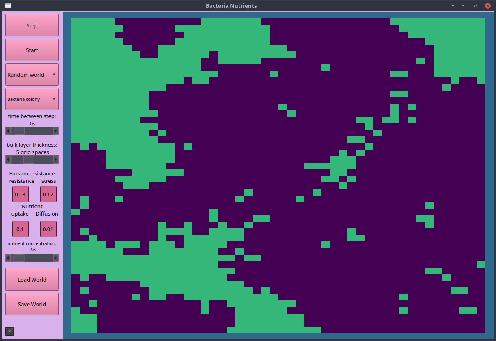
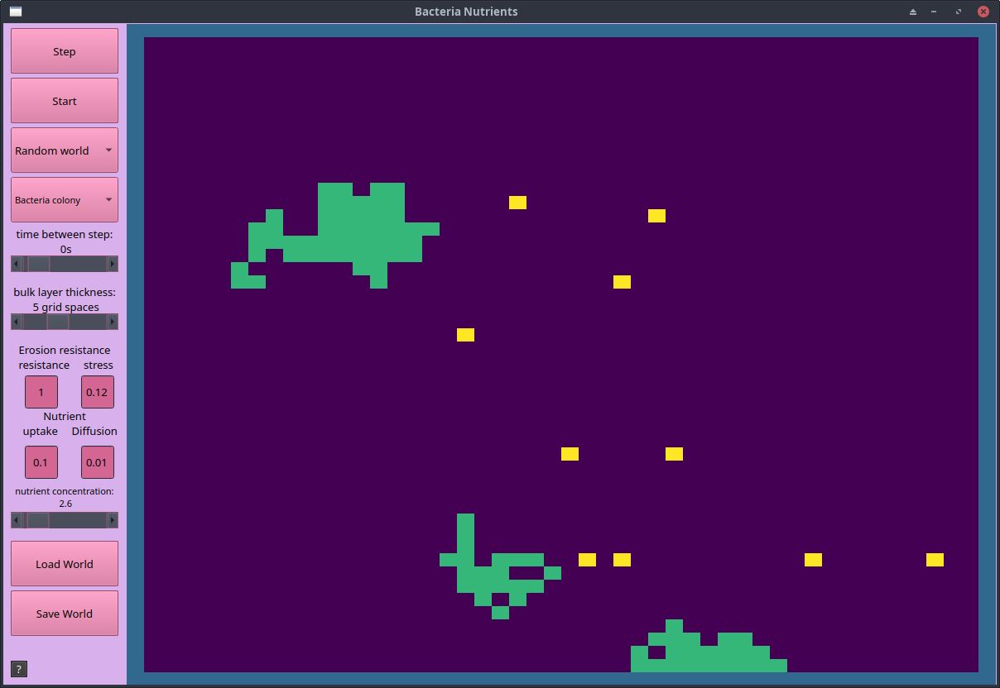
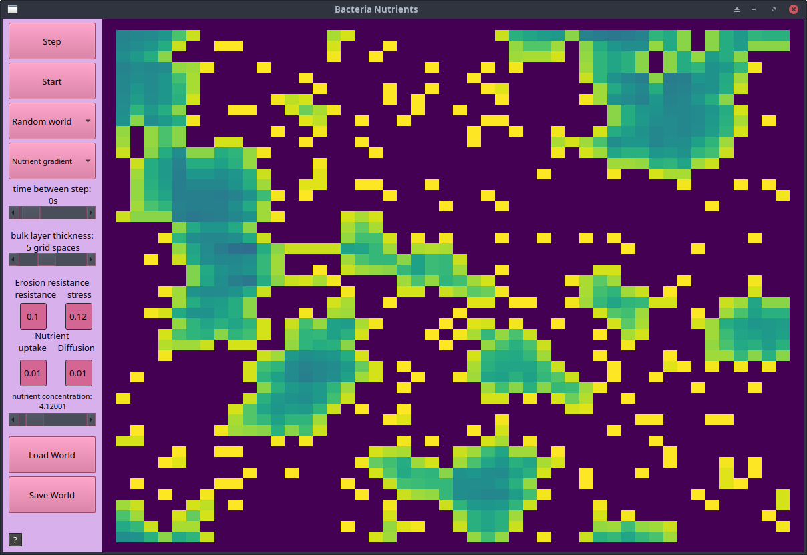

# Bacteria Colony Model
<span style=color:grey>Door:
</span> Ivar Lottman en Ramon Reilman, bio-informatica 

---
## Het doel
* Bacterie biofilm in octave
* Niet gelukt
* Colonie's in octave
---
## De Automaton
* Groei
* Verplaatsing
* Bacteria


---
### Grid en Toestanden

* 4 toestanden
* 50*50

---
### Regels
*   Water cell -> levende bewegende cell
    *   links boven = 3


---
### Regels
* Colonie cel
    * Voedingstof concentratie
    * Kans om te delen
    * Kans om te verdwijnen


---
# <!--fit-->Wiskunde:frowning_face:
---
# Concentratie bepaling
$c = (Cs / (1+\sqrt{k / (2*D) * (\sum_{i=8}1/d^2_i})^{-1})^2$

---

$Pd = nutrientMatrix / nutrientMatrix+K$

---
# Division probability
* Pd > r (0,1)
    * Deel naar random open ruimte


---
# Code
```octave
  % Lege cellen = ~0, levende cellen = 0;
  neighbor_numbers = zeros(size(world));
  neighbor_numbers(world == 0) = rand(size(world(world == 0)));

  % vind de maximale waarde in de omgeving van de cellen
  maxval = zeros(size(neighbor_numbers));
  for delta_x = -1:1
    for delta_y = -1:1
      maxval = max(maxval, circshift(neighbor_numbers, [delta_y, delta_x]));
    endfor
  endfor

  Pd(Pd != 1 & (world ~=1 & world ~= 3) &
  (ismember(neighbor_numbers, maxval(neighbor_numbers == 0 & Pd == 1)))) = 1;
  world(Pd == 1) = 2;
endfunction
```

---
# Erosie
$Pe = 1 / (1+(strength / stress))$

---
# Erosie
* Pe > r (0,1) & cell == surface 
    * cell = 0

---

# <!--fit-->Showcase:computer:
---
# Evaluatie
* Wat ging goed?

* Wat kon beter?

* Wat hadden we nog willen doen?

---

# Conclusie

--- 

# Einde+bronnen

<p>https://www.sciencedirect.com/science/article/pii/S0025556400000493<p>
